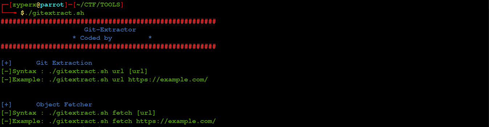
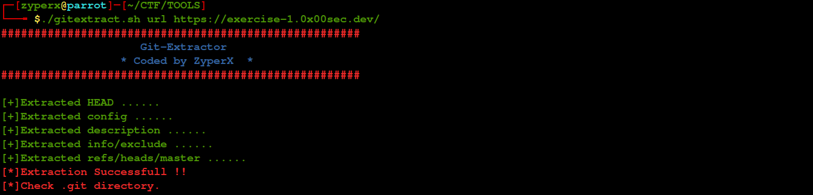
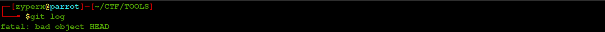
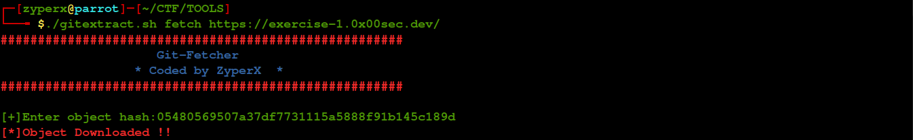
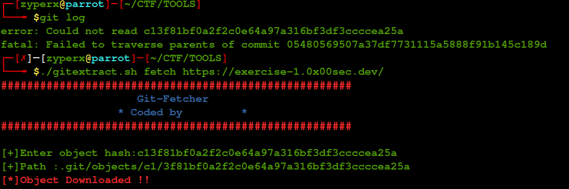
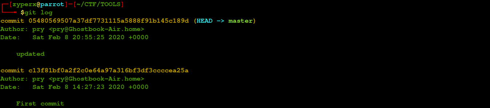
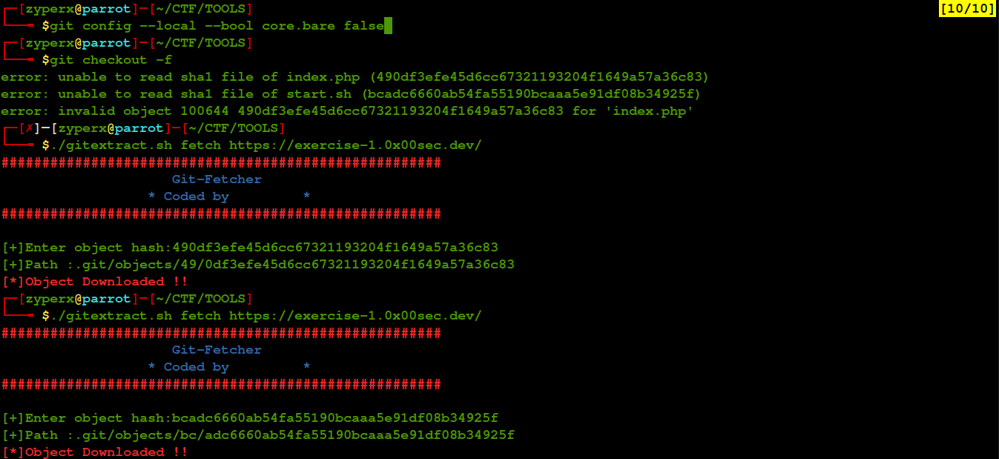
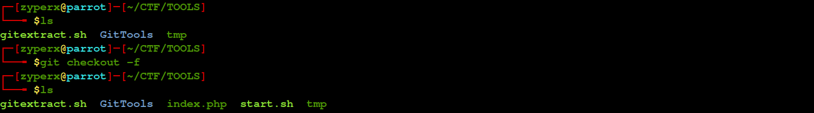

                                             
                                             GIT EXTRACTOR             
                                             
                                             

<H1><U>GIT_EXTRACTOR</U></H1>

[+]A bash program to extract commits and their objects.

This script tries to recover incomplete git repositories:

    Useful in Capture The Flag contest

<h5>[+]Syntax</h5>

<h5>[+]Extracting</h5>

<h5>[+]Incomplete repo</h5>

<h5>[+]Lets see what is HEAD reffering to</h5>

<h5>[+]Fetching Head</h5>

<h5>[+]Checking Log and fixing again</h5>

<h5>[+]Reading Log</h5>

<h5>[+]Restoring Data</h5>

<h2>REQUIREMENTS</H2>
<H4>Executable Permission</H4>
<H4>chmod a+x gitextract.sh</H4>
